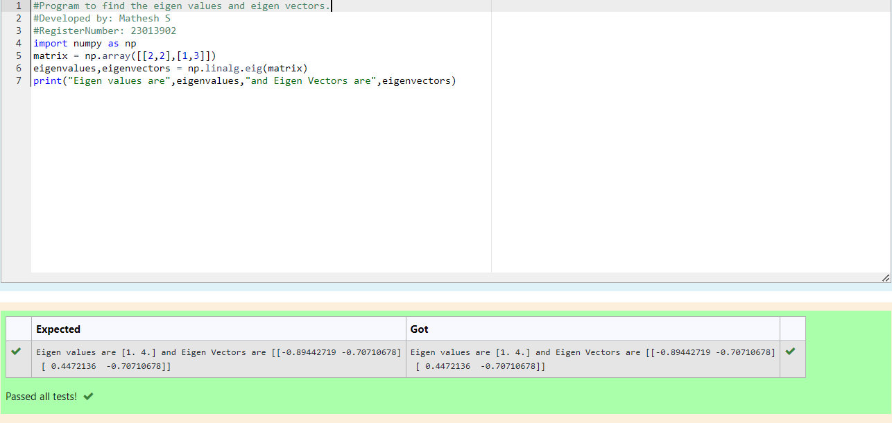

# EIGENVALUES-AND-EIGENVECTORS
## Aim:
To write a python program to find the Eigenvalues and Eigen Vectors
## Equipment’s required:
1. 	Hardware – PCs
2. 	Anaconda – Python 3.7 Installation / Moodle-Code Runner
## Algorithm:

### Step1 : 
Import the numpy module to use the built-in functions for calculation

### Step 2:
prepare a matrix and assign in np.array()

### Step 3:
 Using the np.linalg.eig(),  we get two results (first is eigenvalue and second is eigenvector) of the given matrix.

### Step 4:
End the program

## Program:
```
#Program to find the eigen values and eigen vectors.
#Developed by: Mathesh S
#RegisterNumber: 23013902
import numpy as np
matrix = np.array([[2,2],[1,3]])
eigenvalues,eigenvectors = np.linalg.eig(matrix)
print("Eigen values are",eigenvalues,"and Eigen Vectors are",eigenvectors)

```

## Output:



## Result:
Thus the Eigenvalue and Eigenvector is successfully solved using python program
